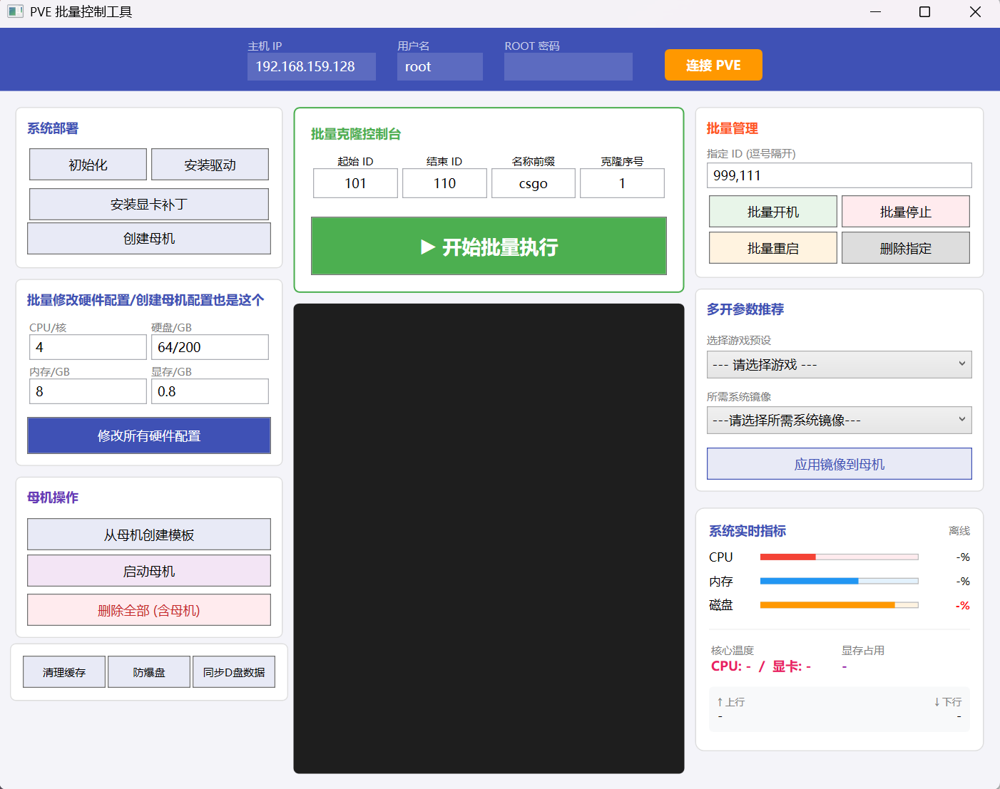

# PVE-tool | 自动化 PVE 运维与 vGPU 部署工具 🚀

本项目是专为 Proxmox VE 深度定制的可视化管理工具。它直接通过 SSH 底层协议绕过冗长的 Web API，实现了对虚拟机集群的“原子级”控制。

---

## 📸 界面预览

*Material Design 风格 UI：左侧连接配置，中间任务中心，右侧实时硬件遥测*

---

## 🔥 核心硬核功能

### 1. 批量克隆与快速交付 (Batch Deployment)
代码通过循环逻辑直接下发 `qm clone` 指令，避开了 Web 端单任务处理的限制：
- **高效克隆：** 支持从指定模板或虚拟机快速生成多个镜像副本。
- **命名规范化：** 自动处理 VMID 步进与主机名映射。

### 2. 动态配置注入 (Config Injection)
基于 `qm set` 指令集，在克隆后实现秒级配置修改：
- **资源重调：** 自动修改 CPU 核心数、内存大小及磁盘挂载路径。
- **vGPU 挂载：** 专门针对 NVIDIA vGPU 环境，通过代码解析 `mdev` 属性并实现一键挂载。

### 3. 智能资源扫描 (Remote Image Discovery)
- **源码实现：** `RefreshRemoteImagesAsync` 方法。
- **功能：** 异步扫描 `/var/lib/vz/template/iso/`，实时同步远程存储状态，支持本地上传与远程下载切换。

### 4. 实时硬件遥测 (Telemetry)
- **显存监控：** 通过解析 `nvidia-smi` 实时反馈 GPU 负载。
- **带宽监控：** 直接读取 `/proc/net/dev`，上行下行流量一目了然，确保运维过程中网络状态可控。

---

## 🛠 技术架构

- **UI 层：** WPF + XAML，采用md配色，降低运维信息过载。
- **通讯层：** 异步 SSH 管道 (`SSH.NET`)，支持多线程任务并发。
- **逻辑层：** 线性任务流设计（KISS原则），确保在机房极端网络环境下仍能保持高响应率。

---

## 📦 部署与使用

### 1. 外部资源准备
本项目采用“代码与大型资源分离”原则。请从云盘下载环境补丁包：
- **补丁包：** `uabba.zip` (含 GPU 驱动及初始化脚本)
- **下载地址：** https://www.123865.com/s/VfDNTd-IAtgv
- **放置路径：** 放入 `/Assets` 文件夹。

### 2. 编译环境
- .NET 6.0+ / Visual Studio 2022
- NuGet 依赖：`Renci.SshNet`

---
